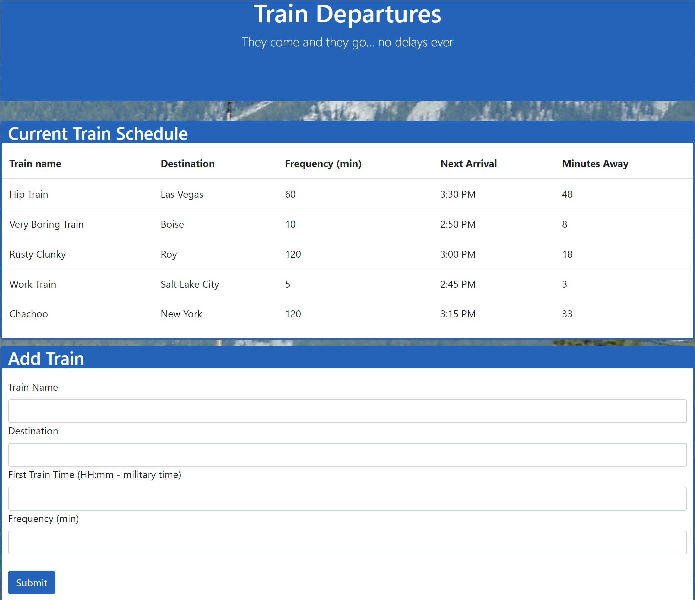

# TrainStation
Firebase Train Departure App - Add train departures and see how long till the next train departs.

To get started just click the link below.

**Here is the link to the deployed page** https://trevorjburni.github.io/TrainStation/

In the center of the page you will see the current train schedule, display information such as the name of the train, where it's going, and when the next train will arrive.

Below the train listings, there is a section to add another train to the schedule. Just fill out the form, hit submit, refresh the page and you will see your new train.

# Technology Used

- HTML
- JavaScript
- Firebase
- CSS
- Twitter Bootstrap

# Future Features

- Add the ability to remove a train from the schedule.
